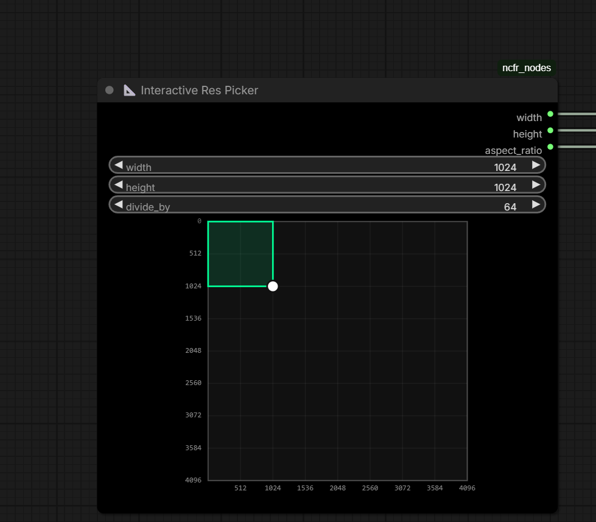

# ComfyUI-InteractiveResPicker

An interactive visual resolution picker custom node for ComfyUI. Drag and scale resolution visually with snap-to-grid capabilities.

Visual dragging box for setting width and height.
Grid snapping based on customizable `divide_by` steps (e.g., 8, 16, 32, 64).
Outputs `width`, `height`, and calculated `aspect_ratio`.
